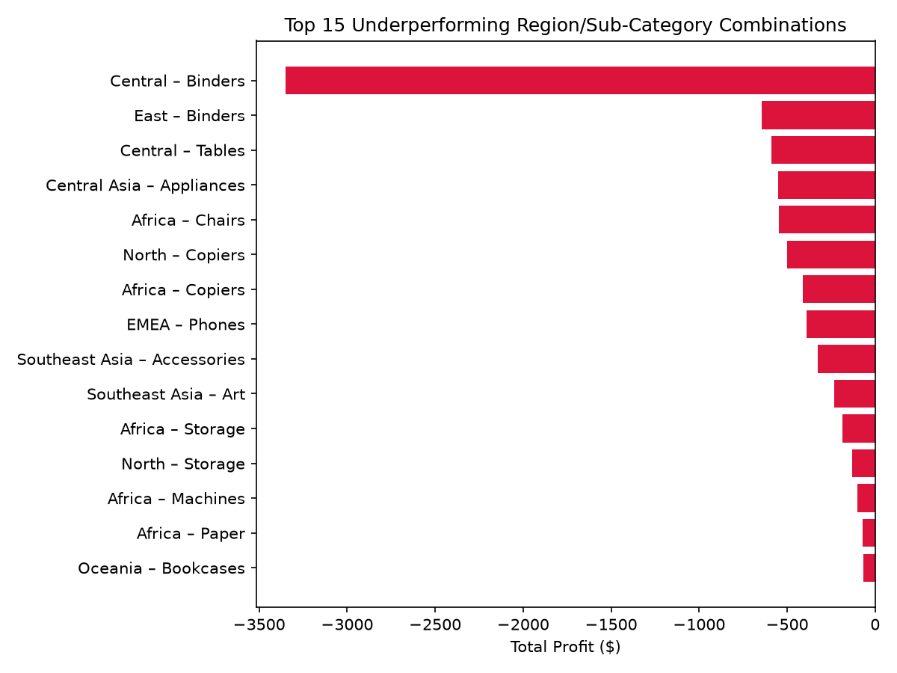
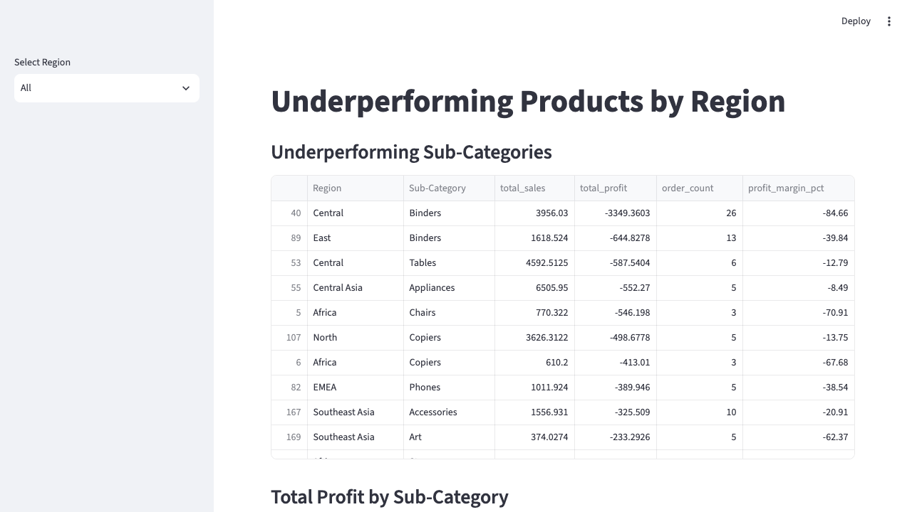

# Underperforming Products by Region

A data analysis project answering a real business question: **which products are
underperforming, and in which regions?** Built with pandas for cleaning, SQL for
analysis, and Streamlit for an interactive dashboard.

## Business Question

Retailers need to know where a product line is losing money or selling poorly so
they can fix pricing, cut inventory, or exit a market. This project identifies
underperforming Region + Sub-Category combinations using three criteria:

1. **Loss-making** — negative total profit
2. **Low margin** — profit margin under 10%, even if profit is technically positive
3. **Below-average sales volume** — sub-category sells far less in one region than
   its average across all regions

## Data

[Global Superstore](https://raw.githubusercontent.com/plotly/datasets/master/global_super_store_orders.tsv) —
1,000 retail orders with Region, Category, Sub-Category, Sales, Profit, and
Quantity.

## Method

1. **Clean** — `Sales`, `Profit`, `Discount`, and `Shipping Cost` were stored as
   text with comma decimals (e.g. `"45,06"`); converted to floats. Dropped
   `Postal Code` (mostly missing, not used in this analysis). Checked for
   duplicates (none found).
2. **Load into SQLite** — cleaned data written to `superstore.db` for querying
   with real SQL.
3. **Analyze with SQL** — aggregated Sales/Profit/Margin by Region + Sub-Category,
   then filtered/ranked for each of the three underperformance criteria above.
   Excluded combinations with fewer than 3 orders to avoid noisy conclusions
   from tiny samples.
4. **Visualize** — bar chart of the worst-performing combinations by total
   profit (`top_underperformers.png`).
5. **Dashboard** — a Streamlit app (`app.py`) with a region filter, so the same
   analysis can be explored interactively instead of reading a static notebook.

## Key Finding

The clearest underperformer: **Central region / Binders**, losing **$3,349** at a
**-84.66% profit margin** across 26 orders — a large, well-supported loss, not
a small-sample fluke.



## Dashboard



## Project Structure

```
underperforming-products/
├── starter.ipynb          # cleaning, SQL analysis, chart
├── app.py                 # Streamlit dashboard
├── global_superstore.tsv  # raw dataset
├── superstore.db          # cleaned data loaded into SQLite
├── top_underperformers.png
└── README.md
```

## Running It

```bash
python3 -m venv .venv
source .venv/bin/activate
pip install pandas matplotlib jupyter notebook streamlit

# Notebook (cleaning + SQL + chart)
jupyter notebook starter.ipynb

# Dashboard
streamlit run app.py
```
